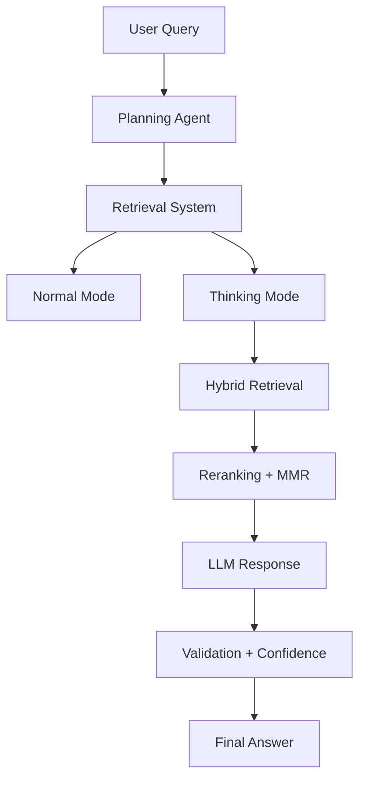

# 🚀 INFERA — Intelligent Multimodal RAG Engine

> A powerful AI system combining Retrieval-Augmented Generation (RAG), multimodal ingestion, deep reasoning, and confidence-aware responses.

---

## 🧠 What is Infera?

Infera is an advanced AI research engine that:
- Understands user queries deeply  
- Retrieves relevant knowledge from multiple sources  
- Applies reasoning (Thinking Mode)  
- Verifies answers using trusted sources  
- Returns responses with confidence scores  

---

## ✨ Key Features

### 🔍 Advanced RAG Pipeline
- FAISS-based vector search  
- Semantic + keyword hybrid retrieval  
- Intelligent chunking & embeddings  

### 🧠 Thinking Mode (Deep Reasoning)
- BM25 + FAISS hybrid retrieval  
- Cross-encoder reranking  
- Adaptive MMR  
- Multi-step query decomposition  

### 🌐 Multimodal Input Support
- PDF (including scanned via OCR)  
- Images (LLM-based understanding)  
- Video & Audio (transcription)  
- Websites & Wikipedia  
- YouTube transcripts  
- DOCX / TXT / HTML  

---

## 🏗️ Architecture Overview


---

## 🧩 Tech Stack

- Python, Flask  
- FAISS, BM25  
- Sentence Transformers  
- Groq API (LLaMA)  
- Supabase  
- OpenCV, Tesseract OCR  
- DuckDuckGo Search, Playwright  

---

## ⚡ Installation

```bash
git clone https://github.com/mrlakshya07/Infera.git
cd Infera
pip install -r requirements.txt
```


🔑 Environment Variables

Create a .env file:
GROQ_API_KEY=your_api_key
SUPABASE_URL=your_supabase_url
SUPABASE_KEY=your_supabase_key

▶️ Run the Project

python final_app_flask.py


📸 Demo


🧪 Use Cases

Research assistant
Document analysis
Study tool
Fact verification


👨‍💻 Team
Lakshya

Bhavya

Shuvajit


⭐ Support

If you like this project, give it a star ⭐
